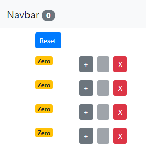
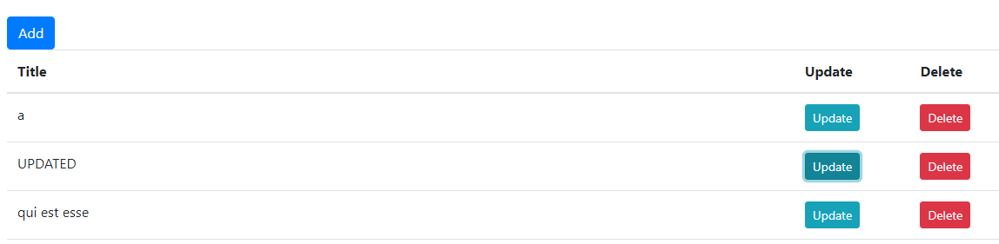
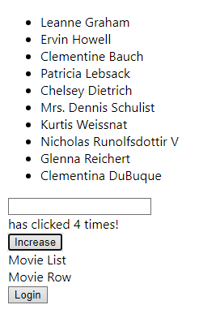
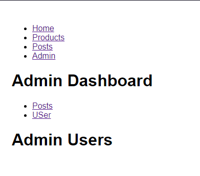
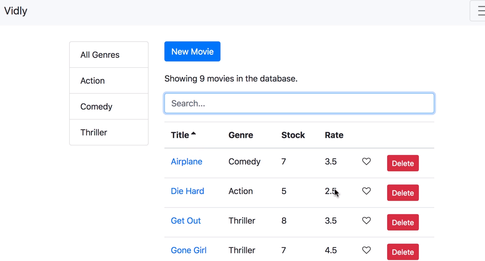

# The react course includes simple code examples built in react
### counter-app:

The application allows you to click 
### http-app:

The application adds an element with the content "a" removes an existing element and updates an existing element
### react-advanced:

This section contains context, hoc and hooks
### react-app
this section contains the basics of the basics

### router-app:

This section introduces Route, Switch, Redirect

### vidly:

Vidly collects all the elements into one node backend was provided by the course creator 